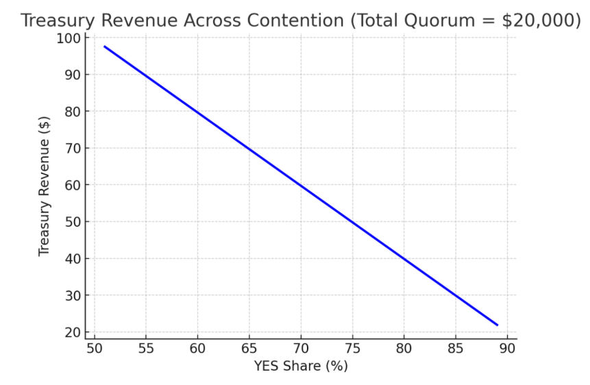

# Sowellian Governance v5

> *“There are no solutions. There are only trade-offs.”* — Thomas Sowell  

---

## Abstract
Sowellian Governance is a system for decentralized and autonomous organizations that ties every proposal to measurable outcomes, enforces accountability through economic skin-in-the-game, and grows organizational treasuries through modest fees.  

Organizations vote on their collective values, proposers risk bonds, voters stake once to express belief, and outcomes are settled against pre-defined Key Performance Indicators.  

The system is designed to align incentives, reward foresight, punish mistakes, and strengthen organizations over time.  

---

## Guiding Principles
- Organizations need clear KPIs to map proposals to.  
- Those who make decisions must pay for mistakes.  
- Proposers compete to surface valuable ideas.  
- Voters stake once to express belief.  
- Change should always leave the organization better off.  
- Reputation is a metric best measured through participation over time.  

---

## Mechanism Overview
> *“Vote on values, bet on beliefs.”* — Robin Hanson  

Organizations vote on their values and their council. Proposals are crafted selecting organization-specific KPIs.  
Proposers must stake bonds when they make proposals. Participants take **Sowellian Bets** on binary YES/NO markets around proposals.  

- If more bets support YES and stake quorum is met by the end of the betting window, the proposal passes.  
- The losing side forfeits their bets to the winning side.  
- The proposer receives **2× ROI** relative to voters.  
- Treasury grows from a flat **1% fee** on betting activity.  

---

## KPIs as DNA
> *“Tell me your KPIs and I’ll know your purpose.”* — Dean Pappas  

At inception, each organization defines its **KPI DNA**: the set of essential metrics that capture organizational performance.  
This catalog is created and amended by **token-vote**, and each KPI is tied to oracle sources.  

Every proposal must specify which KPI it targets and what improvement it expects by the end of the evaluation period.  

**Examples:**  
- Treasury Value  
- Market Cap  
- Number of Users  
- Transactions  
- Page Views  

---

## Proposal Creation and Quorum
- **Proposal bond:** Required to ensure skin-in-the-game. Counts as the first YES bet.  
- **Bond threshold:** 0.5–1.5% of quorum stake.  
- **Bond rationale:** Capped at 1.5% to protect voter incentives. If more conviction, proposer may add YES bets but without the multiplier.  
- **Proposal contents:** Action, KPI targeted, expected improvement.  
  - *Example:* Swap treasury USDC for BTC, targeting treasury value, expecting +5% USD growth.  
- **Passing conditions:**  
  1. Stake quorum met.  
  2. More YES stake than NO stake.  
- **Failure:** If stake quorum not met by the end of the betting window, bond forfeited to treasury.  

> *“It is hard to imagine a more stupid or more dangerous way of making decisions than by putting those decisions in the hands of people who pay no price for being wrong.”* — Thomas Sowell  

---

## Betting (Voting)
- Binary YES/NO staking.  
- **One-way door:** Once a stake is placed, it cannot be withdrawn or switched.  
- Participants may add more to their side (YES or NO) during the betting window, but never reduce or move it.  
- Stakes lock until end of the evaluation window.  

---

## Settlement & Treasury
> *“The first lesson of economics is scarcity: There is never enough of anything to satisfy all those who want it. The first lesson of politics is to disregard the first lesson of economics.”* — Thomas Sowell  

- **No quorum:** Bond forfeited → treasury.  
- **Quorum achieved, NO wins:** All bets + bond refunded; treasury earns nothing.  
- **Proposal passes:**  
  - Losers’ stake transfers to winners after evaluation window.  
  - Treasury receives 1% of losers’ stake transfer.  
  - Remaining 99% split between voters and proposer.  

### Formula
```math
T = \tau \cdot L
```

- **T** = Treasury revenue  
- **τ** = Treasury rake (default 1%)  
- **L** = Loser stake (total losing side)  

---

## Incentives
We guarantee incentives to ensure clarity for why someone should propose or vote.  

### Voters
- Always earn a **positive ROI** if on the winning side.  
- ROI **increases with contention** (closer 51/49 votes → higher returns).  
- ROI **floor-guaranteed at +0.5%** in near-consensus cases (89–90%).  

    
- This example shows the range of return on a $20000 Stake Quorum Proposal

### Voter ROI Formula
```math
R_v = \frac{(1-\tau)\,L}{W + 2B}
```

- **Rᵥ** = voter ROI (fractional; ×100 for %)  
- **W** = total winner stake  
- **L** = total loser stake  
- **B** = proposer bond (0.5–1.5% of quorum)  

---

### Proposers
- Earn **exactly 2× voter ROI** when their proposal passes.  
- Bond capped (0.5–1.5% of quorum) to protect voter upside.  
- If quorum missed, bond forfeited to treasury.  

### Proposer ROI Formula
```math
R_p = 2 \cdot R_v
```

- **Rₚ** = proposer ROI (fractional; ×100 for %)  
- Applies only when **YES** wins  

---

## Council
> *“Democracy is a process by which people are free to choose the wrong man.”* — Thomas Sowell  

- Referees for maintaining integrity and protecting the org from bad actors or faulty oracles.  
- Verifies KPI oracle results.  
- Has **override power** if oracles fail or contradict.  
- **Council elections:** Token-vote, default cycle = 1 year.  
- **Recall:** Members can be removed mid-term.  
- **Conflict guard:** Members cannot propose during their service.  

---

## Parameters (with Defaults)
Sowellian parameters let organizations adapt to their needs.  

**Defaults:**  
- **Stake Quorum** = 0.5% of org marketcap (snapshotted at proposal creation).  
- **Bond Threshold** = 0.5–1.5% of quorum.  
- **Minimum Bet** = org-defined, suggested ≥ 0.1% of quorum.  
- **Betting Window** = 7 days.  
- **Evaluation Window** = 90 days (3 months).  
- **Election Cycle / KPI Setting** = 1 year.  
- **Incentive Guarantees** = Voter floor (+0.5%) and Proposer double (2×).  
- **Treasury Rake** = 1%.  

---

## Execution
- On-chain instructions execute automatically.  
- If execution requires off-chain actions, proposer is responsible.  
- **Failure:** If execution not started by end of evaluation window → proposal fails, all YES bets (including bond) lost to treasury.  

---

## Appendix A: Charts
- Voter vs Proposer ROI across contention  
    

- Treasury revenue across contention  
    

---

## Appendix B: Terms
**Novel concepts in Sowellian Governance**  

- **Sowellian Bet** — A bet on which proposal is best. Determines outcome, settles after evaluation.  
- **Stake Quorum** — Quorum by total capital staked.  
- **Bond Cap** — Max proposer bond (1.5% of quorum).  
- **KPI DNA** — Essential org KPIs, amended by token-vote.  
- **Treasury Rake** — 1% fee taken from losers → winners transfer.  
- **Voter ROI Floor** — Guarantee: +0.5% ROI at high consensus.  
- **Proposer Multiplier** — Proposers always earn 2× voter ROI.  
- **One-Way Door Voting** — Stake once, never withdraw/move. Can only add.  

**Symbols (used in formulas)**  
- **T** — Treasury revenue  
- **τ** — Treasury rake (default 1%)  
- **B** — Proposer bond (0.5–1.5% of stake quorum)  
- **W** — Winner stake (total on winning side)  
- **L** — Loser stake (total on losing side)  
- **Rᵥ** — Voter ROI (fractional; ×100 for %)  
- **Rₚ** — Proposer ROI (fractional; ×100 for %)  

**Essential formulas (collected)**  

```math
T = \tau \cdot L
```

```math
R_v = \frac{(1-\tau)\,L}{W + 2B}
```

```math
R_p = 2 \cdot R_v
```

---

## Appendix C: Future Extensions
Ideas for exploration:  

- **Wallet Quorum** — Quorum by unique wallets (anti-sybil).  
- **Wallet Eligibility Filter** — Only wallets that staked ≥ 0.1% of quorum count.  
- **Supermajority Bypass** — >90% YES = auto-pass, skip evaluation.  
- **Reputation** — Use past performance on outcomes to weight returns or filter roles.  
